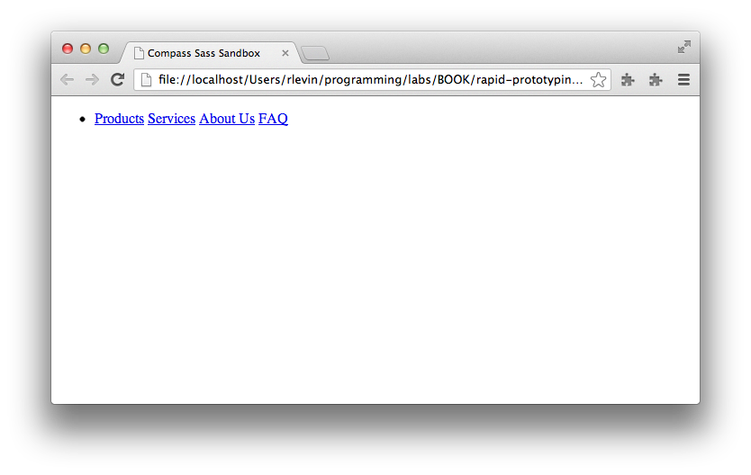
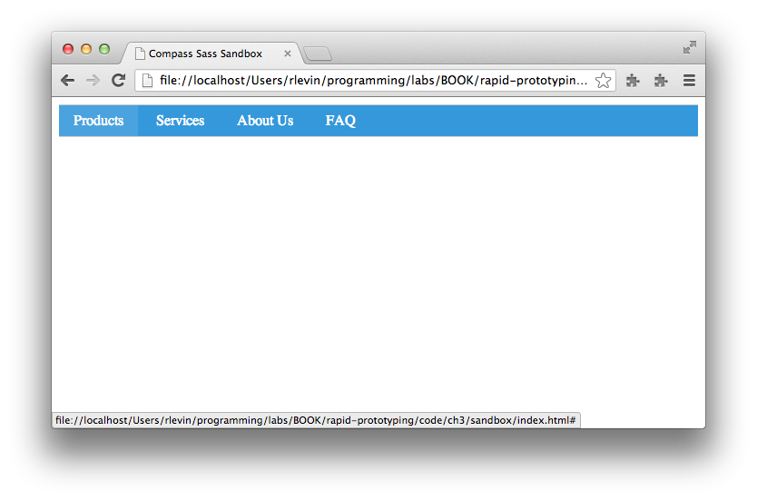
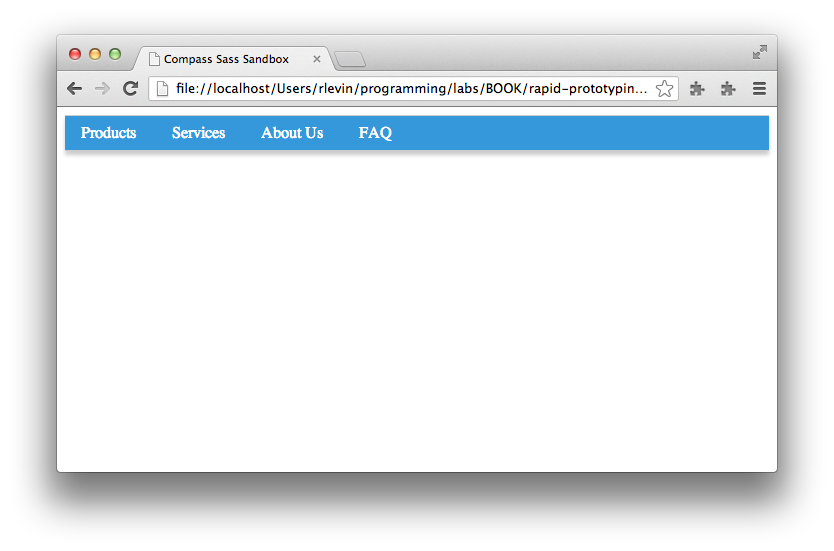
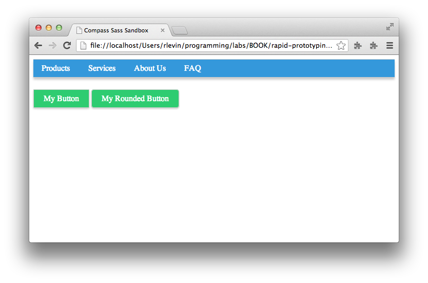

# Introduction to Compass and Sass

This chapter will server as a short introduction to Sass and go over the basic syntax, workflow, etc., as well as introducing the advantages of incorporating Compass as well.
This will be a whirlwind tour (not for the feint of heart); if you'd like a more gentle and complete introduction to Compass and Sass do have a look at [Sass and Compass for Designers][bensassbook] by [Ben Frain][benfrain].

Topics covered:

* Compass/Sass Workflow
    * Compass Essentials: config.rb, watch, and CSS3 mixins
* A sandbox to play in (setting up a test script)
* Variables
* Nesting
* Mixins
* Placeholders
* Structure
    * @import
    * Utilizing partials


## Using Compass to Create a Project

Remember in the last chapter how we manually created a directory structure like:

```bash
|-- css
|-- index.html
|-- sass
    |-- style.scss
```

 Well, don't be mad, but with Compass with can create all of that less the index.html page with the following simple command:

```bash
$ compass create --css-dir "css"
```

The only reason we needed the `--css-dir "css"` part was to force Compass to use the directory name "css" (instead of "stylesheets" which is the default). You can also pass options for where to find your JavaScript and images like `--javascripts-dir "path_to_your_javascript"` and `--images-dir "path_to_your_images"`. These get used to build the config.rb file that we'll be looking at in a bit.

What happens upon issuing the above command is Compass scaffolds out a minimal project for you that looks like:

```bash
|-- config.rb
|-- css
    |-- ie.css
    |-- print.css
    |-- screen.css
|-- sass
    |-- ie.scss
    |-- print.scss
    |-- style.scss
```

Notice that this is essentially what we did manually before with the added benefit that they've added the IE and print files as well (we'll be ignoring the IE stylesheet for the time being). What we had previously named `sass/style.scss` is now `sass/screen.scss`. If you look at the config.rb file you'll notice that our CSS and Sass directories are where you'd expect:

```bash
css_dir = "css"
sass_dir = "sass"
```

No surprises there.

## A Sandbox to Play In

As Compass is really only concerned with stylesheet related things, we didn't get an index.html page so let's create that now:

```html
<!doctype html>
<head>
    <title>Compass Sass Sandbox</title>
    <link href="css/screen.css" media="screen, projection" rel="stylesheet" type="text/css" />
    <link href="css/print.css" media="print" rel="stylesheet" type="text/css" />
</head>
<body>
    <div class="test">This is a test.</div>
</body>
</html>
```

Above, we've included our `screen.css` or `print.css` files dependent on if we're printing or not. Let's now have a look at that config.rb configuration file.

## Compass Configuration

Let's take the configuration file section by section:

```bash
http_path = "/"
css_dir = "stylesheets"
sass_dir = "sass"
images_dir = "images"
javascripts_dir = "javascripts"
```

This should be fairly self-evident but the `http_path` sets the root HTTP directory of the project from which all other paths will be relative to. If you wanted to add fonts too you might add the line:

```bash
fonts_dir = "fonts"
```

Let's have a look at the output style line:

```bash
# output_style = :expanded or :nested or :compact or :compressed
```

Let’s assume we have the following defined in an .scss file:

```css
.test {
    color: #ddd;
    .klass: {
        color: #aaa;
    }
}
```

By default, the output style will look something like this:

```css
/* line 7, ../sass/screen.scss */
.test {
  color: #ddd;
  .klass-color: #aaa;
}
```

Notice that nothing's changed other than we have a comment that identifies the line and file. Changing the output_style to `:nested` we get:

```css
/* line 7, ../sass/screen.scss */
.test {
  color: #ddd;
  .klass-color: #aaa; }
```

Notice that resulting css is nested. Now let’s try `:compact`

```css
/* line 7, ../sass/screen.scss */
.test { color: #ddd; .klass-color: #aaa; }
```

Notice that the CSS was all put on one line. Last let's finally try  `:compressed`

```css
.test{color:#ddd;.klass-color:#aaa}
```

Notice that the comment was removed along with all white space.

I'd suggest just leaving this parameter alone for the time-being as it will be easier to debug. Before generating production code you'd likely want to use `:compressed` to ensure speedy delivery. While there are more configuration options available, this should be enough for our purposes. If you need more detail have a look at the [Compass Reference documentation][compassdocs] which covers the options in detail.

## Sass Features

Now that we're properly utilizing Compass to help us with our Sass workflow, let's dive in to the Sass syntax itself. We'll cover just enough of the features to get you started (as always, for more detailed coverage we suggest you go the the reference documentation).

We're going to use a simple navigation bar to go over a few Sass syntax concepts. Let's go ahead and replace the content within our `<body>` tags from:

```html
    <div class="test">This is a test.</div>
```

to the following navigation markup:

```html
    <ul id="nav">
        <li>
            <a href="#">Products</a>
            <a href="#">Services</a>
            <a href="#">About Us</a>
            <a href="#">FAQ</a>
        </li>
    </ul>
```

At this point you should have something very plain like:



Now let's go to [http://flatuicolors.com/][flatuicolors] and grab some colors for our navigation bar (feel free to use your own colors...I've chosen blue colors). Since you're probably already familiar with CSS, let's go ahead and show how we might style the navigation bar with vanilla CSS.

Place the following CSS in `sass/screen.scss`:

```css
#nav {
    margin: 0 auto;
    padding: 0;
    list-style: none;
    background-color: #3498db;
    border-bottom: 1px solid #ccc;
    border-top: 1px solid #ccc;
}
#nav li a {
    display: inline-block;
    padding: 0.5em 1em;
    text-decoration: none;
    font-weight: normal;
    color: #fff;
}
#nav li a:hover {
    color: #fafafa;
    background-color: #4aa3df;
}
```

As you can see, this is plain old CSS. As Sass's `.scss` syntax is just a super-set of CSS, we can use any valid CSS within a Sass `.scss` file.

Now go ahead and either run `compass compile`, or, better yet, start a _watch_ on our Sass files by issuing: `compass watch`. You should do this from another terminal tab in the same project directory so changes get immediately detected and compiled to CSS.

You should see something like the following (this will be our, ahem, amazing end result for the exercise):



Ok, so now that we have a working example of a pleasant (if extremely simple) navigation bar using CSS. Let's now see how we might _refactor_ this CSS using Sass to make our lives easier.

### Variables

If you look at the CSS we have at this point, you should notice that we have some _duplication_ in our hex colors (e.g. `#ccc` is repeated twice, and `#fff` and `#fafafa` are definitely related). We can do better.

You've already seen in an earlier chapter that we can define variables in Sass using `$variable_name`. Let's do that by adding a `$white` and `$grey` at the top of the `sass/screen.scss` file, and then reference those variables as needed:

```css
$grey: #ccc;
$white: #fff;
#nav {
    margin: 0 auto;
    padding: 0;
    list-style: none;
    background-color: #3498db;
    border-bottom: 1px solid $grey;
    border-top: 1px solid $grey;
}
#nav li a {
    display: inline-block;
    padding: 0.5em 1em;
    text-decoration: none;
    font-weight: normal;
    color: $white;
}
#nav li a:hover {
    color: darken($white, 2%);
    background-color: #4aa3df;
}
```

_`darken` towards the bottom should be fairly self-evident, but it's what is called a "mixin" (something we'll talk about shortly); for now, just now that it will darken the white by 2% leaving us with the `#fafafa` we had earlier._

Let's go ahead and do a bit more by replacing our `background-color` with a `$blue` variable. This time we'll be using the `lighten` mixin which does the inverse of `darken`:

```css
// Base Colors
$grey: #ccc;
$white: #fff;
$blue: #3498DB;//peter-river blue
#nav {
    margin: 0 auto;
    padding: 0;
    list-style: none;
    background-color: $blue;
    border-bottom: 1px solid $grey;
    border-top: 1px solid $grey;
}
#nav li a {
    display: inline-block;
    padding: 0.5em 1em;
    text-decoration: none;
    font-weight: normal;
    color: $white;
}
#nav li a:hover {
    color: darken($white, 2%);
    background-color: lighten($blue, 5%);
}
```

So we now have some color variables defined which can be used throughout the rest of our project as it grows. The next thing we can work on is the structure.

### Nesting

In our CSS so far, we have a lot of repetition of the `#nav` selector. Let's use Sass's nesting feature to organize that into a more readable structure:

```css
#nav {
    margin: 0 auto;
    padding: 0;
    list-style: none;
    background-color: $blue;
    border-bottom: 1px solid $grey;
    border-top: 1px solid $grey;
    li a {
        display: inline-block;
        padding: 0.5em 1em;
        text-decoration: none;
        font-weight: normal;
        color: $white;
        &:hover {
            color: darken($white, 2%);
            background-color: lighten($blue, 5%);
        }
    }
}
```

Most of this should be self-evident, but what's happening, is that Sass is smart enough to take that nested structure and convert it in to valid CSS. In fact, here's the CSS that's created from the above `.scss` file:

```css
/* line 5, ../sass/screen.scss */
#nav {
  margin: 0 auto;
  padding: 0;
  list-style: none;
  background-color: #3498db;
  border-bottom: 1px solid #cccccc;
  border-top: 1px solid #cccccc;
}
/* line 12, ../sass/screen.scss */
#nav li a {
  display: inline-block;
  padding: 0.5em 1em;
  text-decoration: none;
  font-weight: normal;
  color: white;
}
/* line 18, ../sass/screen.scss */
#nav li a:hover {
  color: #fafafa;
  background-color: #4aa3df;
}
```

It looks pretty much like what we had before as the nested `#nav` blocks have been properly converted for CSS, and of course, our variables have been evaluated and converted to their actual hex values.

What's that `&:hover {` bit you say? Let's break that down:

* The `&` means "insert my parent selector here"
* So the `&` will essentially be replaced with an `a`
* the `:hover` is just a plain old `:hover` pseudo-class, so this will be turned in to: `a:hover`.

Just remember that anytime you see that `&`, you can say in your head "insert parent selector here".

_Caution: This nesting feature, while attractive from an organizational and aestetic perspective, can be a bit dangerous. You should avoid too many levels of nesting (perhaps 4). Read more information on why at this article on the ["Inception Rule"][inceptionrule]._

### Mixins

Mixins are a feature of Sass that allow you to create re-usable CSS. To define a mixin you must use the `@mixin` directive followed by the mixin's name and any arguments it accepts in paranthesis. This is all followed by a CSS block containing the contents of the mixin. An example should make this all a bit clearer:

```css
@mixin box-shadow($def) {
    -moz-box-shadow: $def;
    -webkit-box-shadow: $def;
    box-shadow: $def;
}
```

Above we have the `@mixin` directive followed by the name `box-shadow` followed by a parameter list of just one `$def` argument. This is all followed by the block which defines the CSS rules (in this case it's just some convenience for dealing with vendor prefixes).

To use this mixin we might do:

```css
    @include box-shadow(0px 4px 5px $grey);
```

In fact, let's add this to our navigation bar with the following in `sass/screen.scss`:

```css
// Base Colors
$grey: #ccc;
$white: #fff;
$blue: #3498DB;//peter-river blue
@mixin box-shadow($def) {
    -moz-box-shadow: $def;
    -webkit-box-shadow: $def;
    box-shadow: $def;
}
#nav {
    margin: 0 auto;
    padding: 0;
    list-style: none;
    background-color: $blue;
    border-bottom: 1px solid $grey;
    border-top: 1px solid $grey;
    @include box-shadow(0px 4px 5px $grey);
    li a {
        display: inline-block;
        padding: 0.5em 1em;
        text-decoration: none;
        font-weight: normal;
        color: $white;
        &:hover {
            color: darken($white, 2%);
            background-color: lighten($blue, 5%);
        }
    }
}
```

Our navigation bar now has a subtle shadow:



While this is not an extremely impressive mixin, it does provide an example of how they work. _It just so turns out, that Compass provides its own box-shadow mixin that we'll be levaraging later._

The possibilities with mixins are truly endless as we can see by this next example refactoring where we've moved out the horizontal navigation CSS in to it's own mixin and then included that in our `#nav` rule:

```css
@mixin horizontal-navbar {
    margin: 0 auto;
    padding: 0;
    list-style: none;
    li a {
        display: inline-block;
        padding: 0.5em 1em;
        text-decoration: none;
        font-weight: normal;
        color: $white;
        &:hover {
            color: darken($white, 2%);
            background-color: lighten($blue, 5%);
        }
    }
}
#nav {
    background-color: $blue;
    border-bottom: 1px solid $grey;
    border-top: 1px solid $grey;
    @include box-shadow(0px 4px 5px $grey);
    @include horizontal-navbar;
}
```

Mixins aren't all perfect though. Anytime you use a mixin using the `@include` directive, keep in mind that the rules in your mixin's block will all get copied over potentially causing duplication. This isn't always a problem, but if it concerns you, you'll be happy to hear that we have an alternative feature in Sass called _placeholders_ which circumnavigate this issue alltogether.

### Placeholders

Placeholders look like class and id selectors but instead use `%` before the name. They work in tandem with the `@extend` directive which allows a selector to inherit from another.

```css
%button {
    padding: .5em 1.2em;
    font-size: 1em;
    color: $white;
    background-color: $green;
    text-decoration: none;
    border: 1px solid $grey;
    @include box-shadow(0px 2px 4px $grey);
    &:hover {
        color: darken($white, 5%);
        background-color: lighten($green, 10%);
    }
}
.button {
    @extend %button;
}
.rounded-button {
    @extend %button;
    @include border-radius(5px);
}
```

The way `@extend` works is that Sass uses CSS inheritance to re-use the block so duplication is avoided. For example, the above `.scss` code gets converted to the following CSS (pay attention to the first line indicating that the `.button` and `.rounded-button` inherit the same rules):

```css
.button, .rounded-button {
  padding: 0.5em 1.2em;
  font-size: 1em;
  color: white;
  background-color: #2ecc71;
  text-decoration: none;
  border: 1px solid #cccccc;
  -moz-box-shadow: 0px 2px 4px #cccccc;
  -webkit-box-shadow: 0px 2px 4px #cccccc;
  box-shadow: 0px 2px 4px #cccccc;
}
.button:hover, .rounded-button:hover {
  color: #f2f2f2;
  background-color: #54d98c;
}
.rounded-button {
  -moz-border-radius: 5px;
  -webkit-border-radius: 5px;
  -ms-border-radius: 5px;
  border-radius: 5px;
}
```



As you can see, the two buttons share the CSS they have in common with only the border-radius being additionally added to `.rounded-button`. It's easy to imagine adding some text shadow, linear gradients, etc., to have a nice `%button` that all of you're project's buttons can `@extend` from.

### Structure

#### @import

#### Partials

## Summary

So we've now seen the power of Compass and Sass combined and have a better understanding of the basic syntax that's used to author `.scss` files. We've purposely used these tools in isolation to get a better understanding of how they work on their own.

We'll soon tie these "CSS preprocessing tools" in with our favorite workflow tool, Yeoman, as some of the boiler-plate Compass commands are taken care of for us by the later (e.g. you don't need to do `compass create` when using Yeoman since it takes care of that for you). However, before we can look at that integration, let's first make sure we understand some of the core workflow tools that Yeoman is comprised of.

